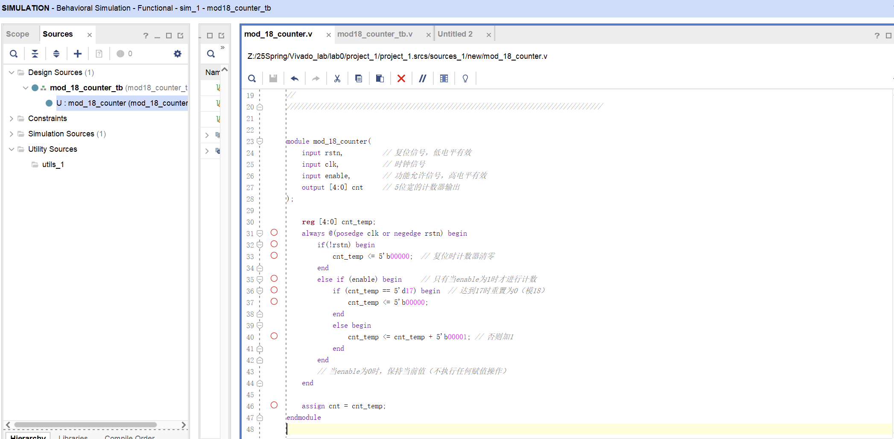
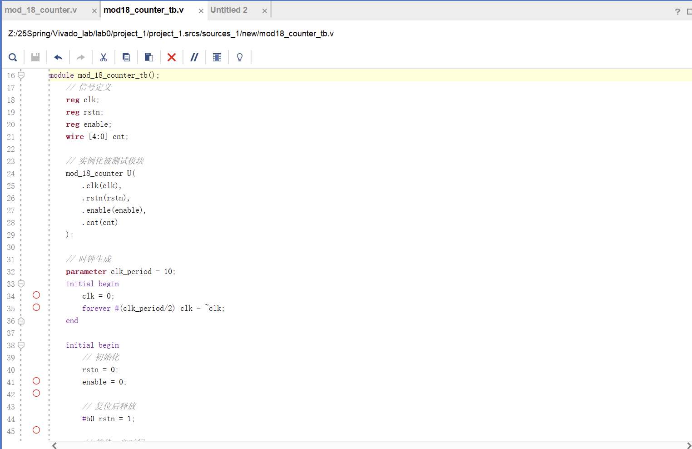
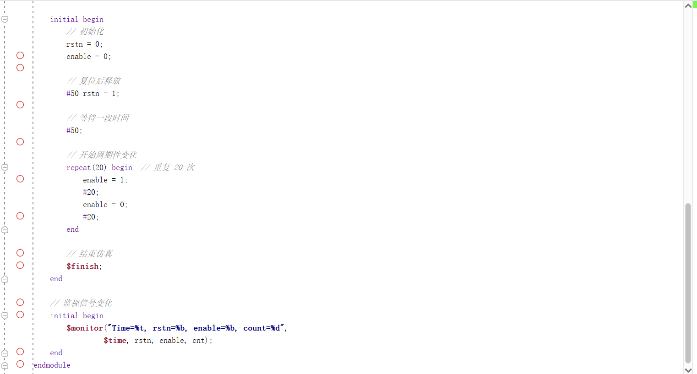
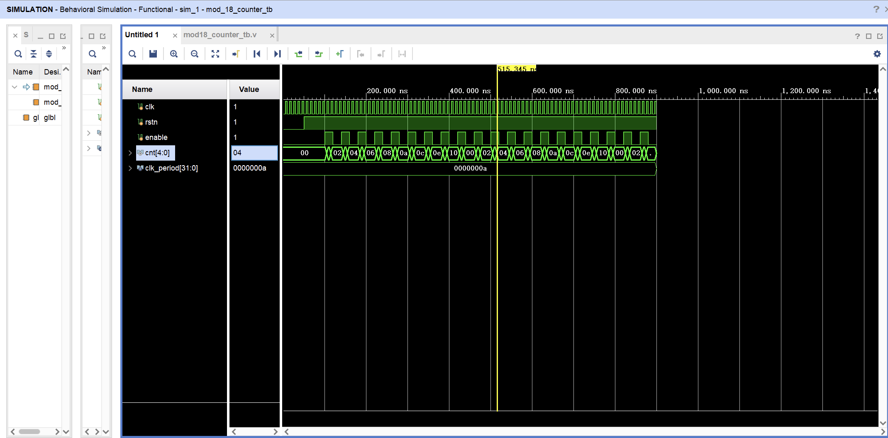
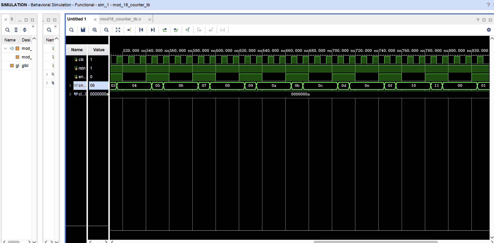

# Lab0 - Verilog预备实验

## 带功能允许信号的模18计数器设计说明
`mod_18_counter.v` ：实现计数器模块的文件。模块定义的输入信号为复位信号`rstn`，时钟信号`clk`，功能允许信号`enable`，输出信号为位宽为5的计数信号`cnt`。

模块采用`always`和`if`、`else`组合逻辑实现。在复位信号下降沿或始终信号上升沿触发模块控制逻辑，当内部寄存器`cnt_temp`值为0d17时置为0，否则在每个上升沿+1，实现mod18计数功能；仅当`enable`为1时触发计数，否则不对`cnt_temp`作阻塞赋值，实现功能允许信号的功能；最后将cnt_temp用`assign`语句非阻塞赋值给输出信号`cnt`，输出计数结果。

`mod_18_counter_tb.v`：实现testbench的文件。首先定义寄存器型变量`cnt`，`rstn`，`enable`作为`mod_18_counter`模块实例`U`的输入，线型变量`cnt`作为模块实例的输出。在第一个初始化块`initial`中使用`forever`循环生成时钟信号，在第二个初始化块中进行仿真进程。首先初始化`rstn`,`enable`信号，将`rstn`信号置`1`将计数器模块复位，随后`repeat`中反复将`enable`置1再置0共20次，检测功能允许信号和模块计数功能是否正常。

## 仿真结果
以下分别是仿真执行结果的整体和局部细节图

与testbench的操作逻辑符合，先`rstn`复位再反复将`enable`置1共20次。

与模18计数器的功能相符合，当`enable`置为0时计数停止，当`enable`置为1时在时钟上升沿正常进行模18计数。

