# Lab5: 基于RISC-V流水线CPU的指令执行过程在线仿真与冒险处理方式研究
## 实验目的
1. 理解流水线CPU指令执行过程。
2. 理解流水线CPU冒险处理的概念与方法。

## 实验平台
WebRISCV: RISC_V架构 RV32/64IM 五级流水线CPU模型在线仿真平台（RV32IM模式）。  
https://webriscv.dii.unisi.it/index.php

## 测试代码段1仿真

### 测试代码段

```assembly
addi x6,x6,2
loop: beq x6,x0,fi
addi x6,x6,-1
addi x5,x5,3
j loop
fi: add x4,x4,x5
nop
nop
```

### 仿真结果

<figure style="text-align: center;">
  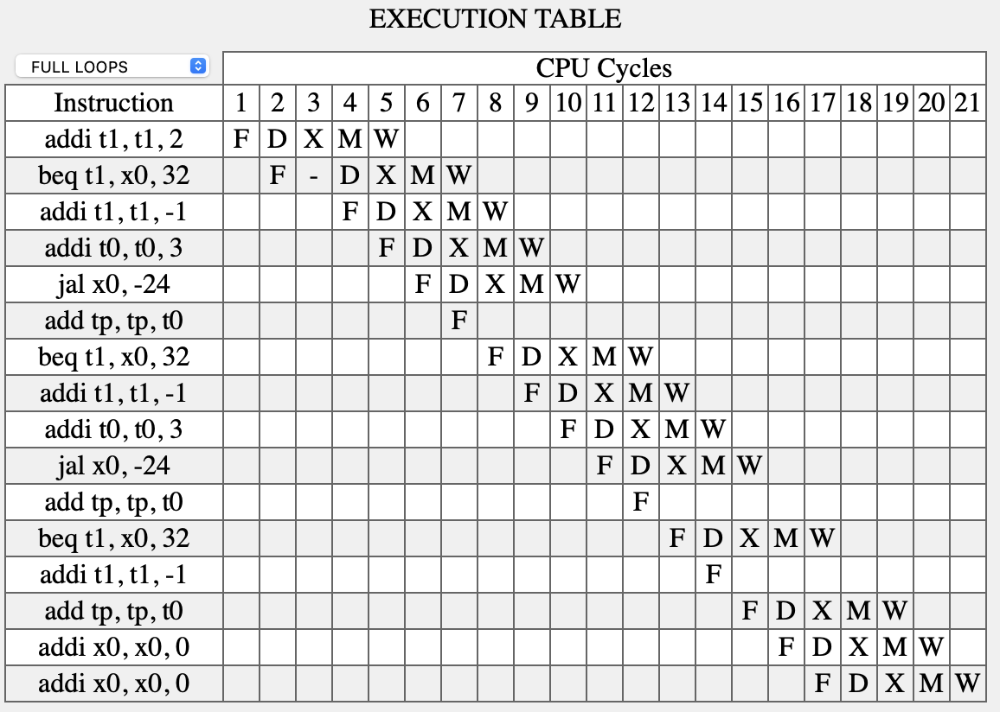
  <figcaption>图1：With forward with flush</figcaption>
</figure>

<figure style="text-align: center;">
  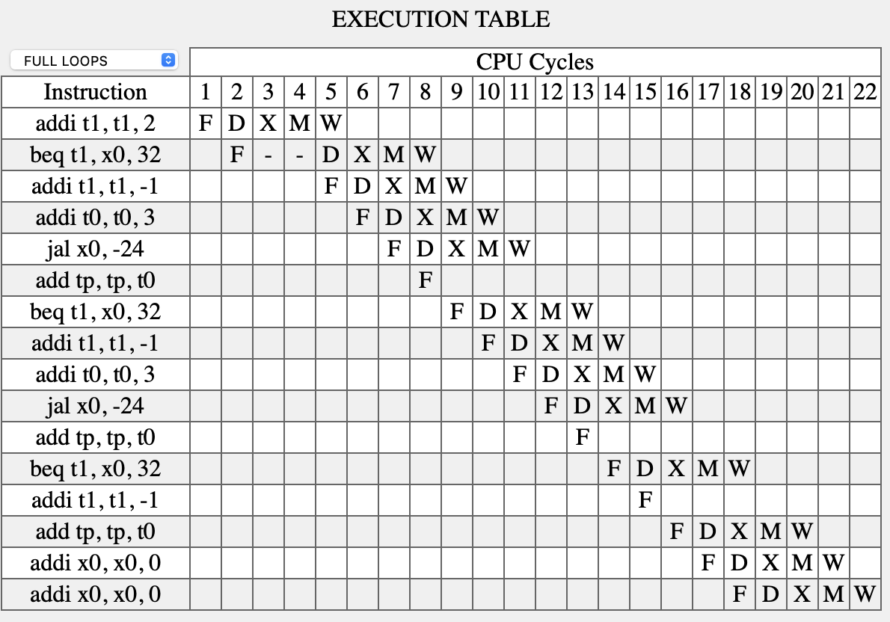
  <figcaption>图2：No forward with flush</figcaption>
</figure>

<figure style="text-align: center;">
  
  <figcaption>图3：With forward no flush</figcaption>
</figure>

<figure style="text-align: center;">
  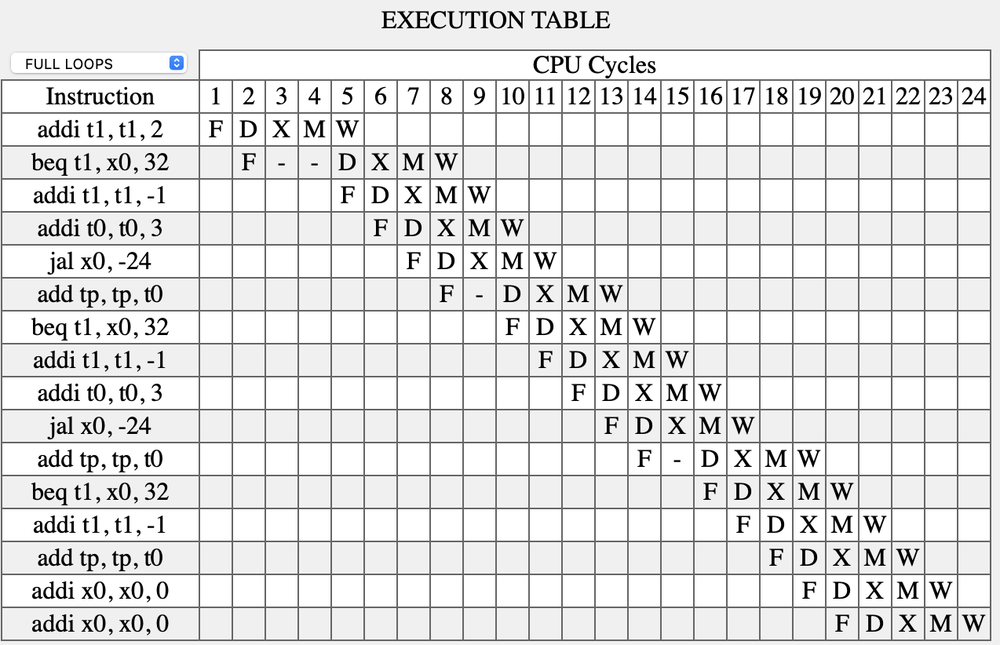
  <figcaption>图4：No forward no flush</figcaption>
</figure>


### 填表分析

<figure style="text-align: center;">
  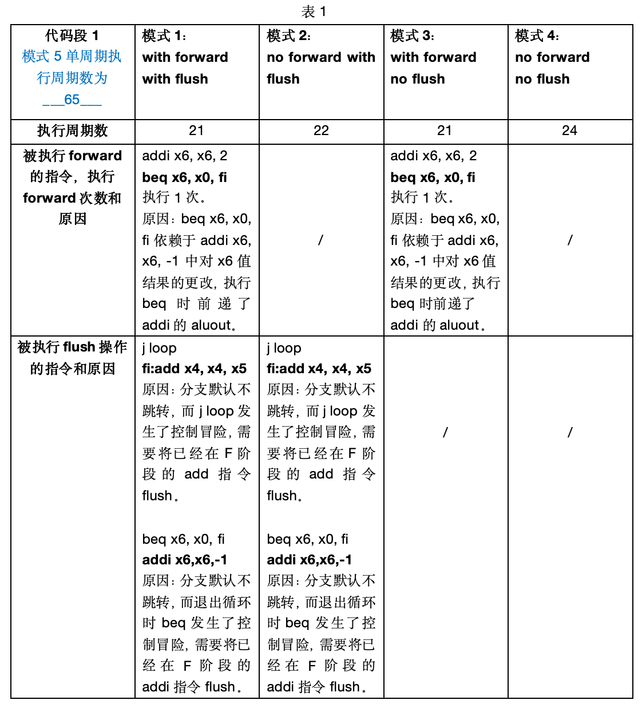
</figure>

<figure style="text-align: center;">
  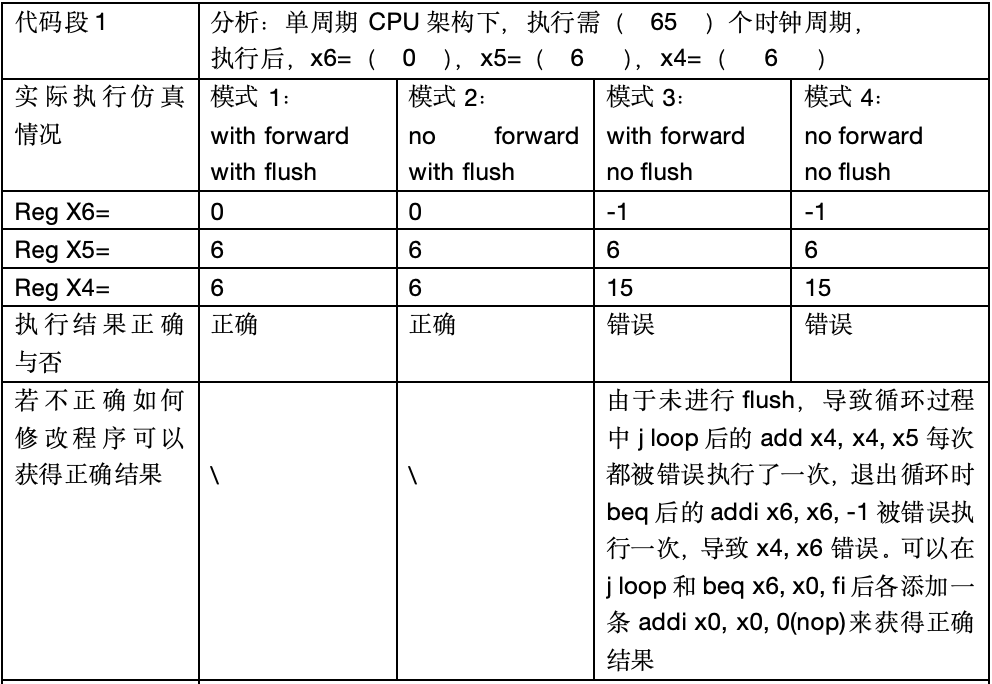
</figure>

修改后：

```assembly
addi x6,x6,2
loop: beq x6,x0,fi
nop
addi x6,x6,-1
addi x5,x5,3
j loop
nop
fi: add x4,x4,x5
nop
nop
```

结果正确:
<figure style="text-align: center;">
  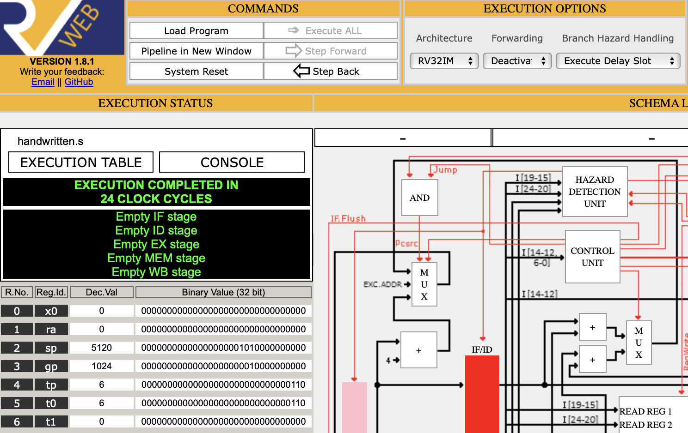
  <figcaption>图5：添加nop后结果正确</figcaption>
</figure>

## 自定义代码段仿真

代码段
```assembly
addi x4, x0, 1
addi x5, x0, 1024
sw x4, 0(x5)
lw x6, 0(x5)
addi x6, x6, 1
```

取消/开启forwarding的执行表如下

<figure style="text-align: center;">
  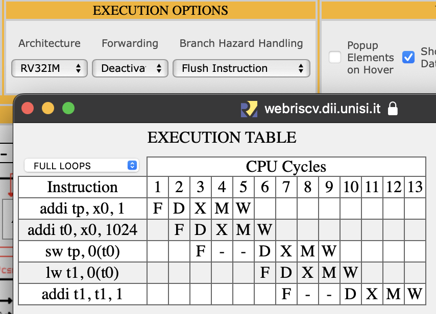
  <figcaption>图6：No forwarding</figcaption>
</figure>

<figure style="text-align: center;">
  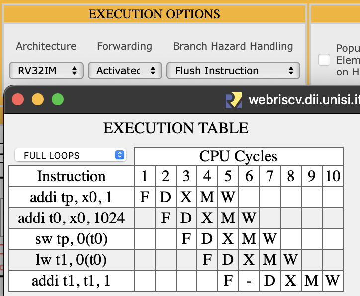
  <figcaption>图7：With forwarding</figcaption>
</figure>

`sw x4, 0(x5)`发生了数据冒险，无forwarding时需等待`addi x5, x0, 1024`通过WB阶段更新x5寄存器的值，`sw x4, 0(x5)`才能被发射进入EX阶段获取正确的寄存器值。而开启forwarding后可以直接将addi指令的ALU输出转发给ALU输入，使sw可以直接使用更新后的x5值。

`addi x6, x6, 1`发生了数据冒险，无forwarding时需等待`lw x6, 0(x5)`经过WB更新寄存器值，有forwarding时可以直接将Memory阶段lw中数据mem的输出转发给addi指令，使addi无需等待lw经过WB阶段而直接使用x6的值。

## 测试代码2仿真

测试代码段
```assembly linenostart=1
lui x10, 0
ori x4, x10, 1024  
addi x25, x0, 1
addi x26, x0, 2
addi x27, x0, 3
addi x28, x0, 4
sw x25, 0(x4)
sw x26, 4(x4)
sw x27, 8(x4)
sw x28, 12(x4)
addi x5, x0, 4
call: jal sum   
sw x12, 0(x4)
lw x19, 0(x4)
sub x18, x19, x12
addi x5, x0, 3
loop2: addi x5, x5, -1
ori x18, x5, -1
xori x18, x18, 1365
addi x19, x0, -1
andi x20, x19, -1
or x16, x20, x19
xor x18, x20, x19
and x17, x20, x16
beq x5, x0, shift
j loop2
shift: addi x5, x0, -1
slli x18, x5, 15
slli x18, x18, 16
srai x18, x18, 16
srli x18, x18, 15
fi: j fi
sum: add x18, x0, x0
loop: lw x19, 0(x4)
addi x4, x4, 4
add x18, x18, x19
addi x5, x5, -1
bne x5, x0, loop
slli x12, x18, 0
jr ra
```

### 填表分析

<figure style="text-align: center;">
  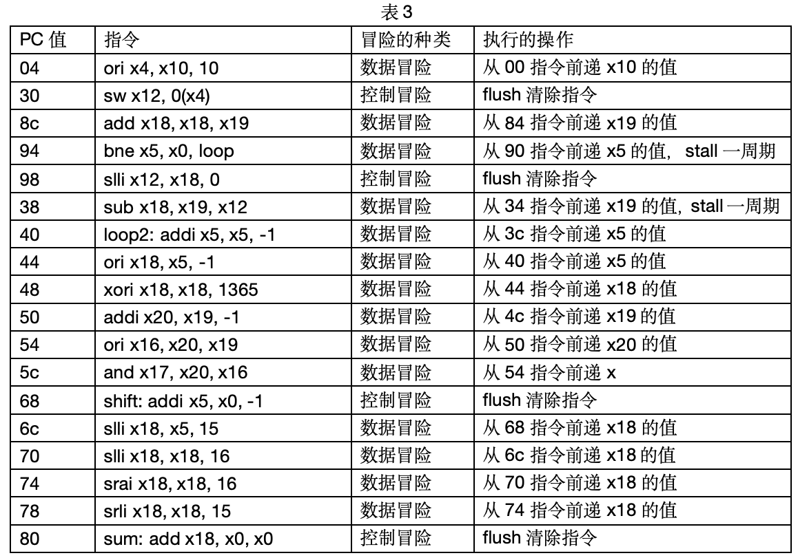
</figure>

执行表截图：
<figure style="text-align: center;">
  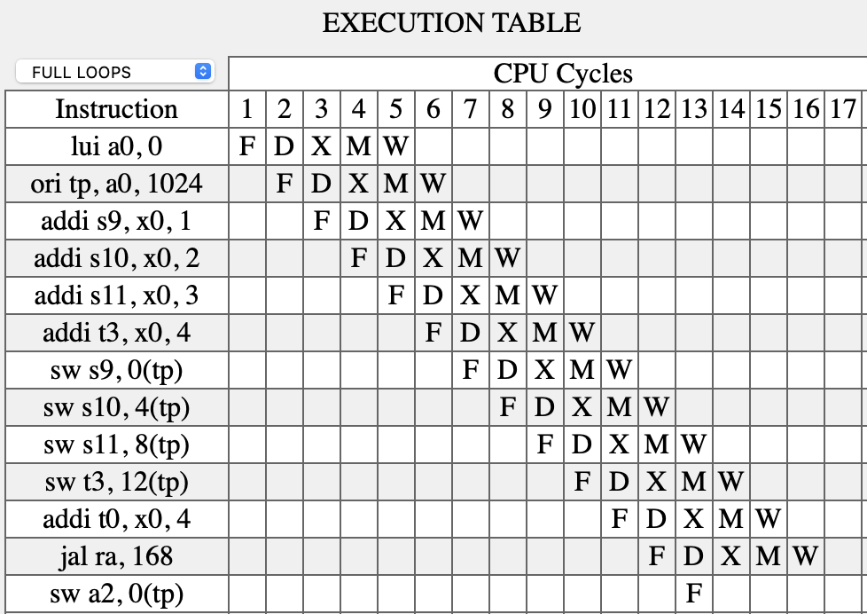
  <figcaption>图8：With forwarding</figcaption>
</figure>

<figure style="text-align: center;">
  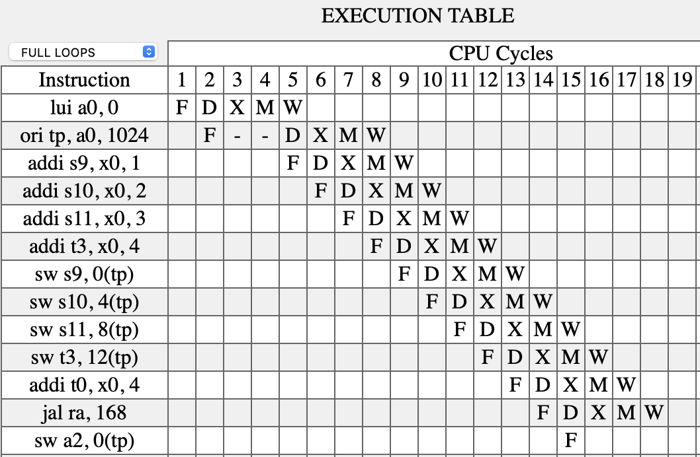
  <figcaption>图9：No forwarding</figcaption>
</figure>

截图举例：`ori x4, x10, 1024`指令用到了`lui x10, 0`前递的`x10`的值，故no forwarding时要停顿，此处发生了数据冒险。
`sw x12, 0(x4)`被flush，因为`jal sum`发生了控制冒险。

### 选做：各模式执行对比

<figure style="text-align: center;">
  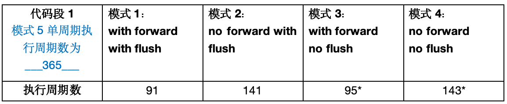
</figure>

说明：单周期执行周期数使用Ripes仿真软件的单周期模式执行得到执行周期数后x5得到在实际的执行周期数。no flush模式中程序会错误执行如下代码段中`j loop2`后的`addi x5, x0, -1`，退出循环时会错误执行`beq`后的`j loop2`导致程序进入死循环无法跳出，故测量时加入nop来测出no flush时的执行周期数。

```assembly linenostart=1
loop2: addi x5, x5, -1
ori x18, x5, -1
xori x18, x18, 1365
addi x19, x0, -1
andi x20, x19, -1
or x16, x20, x19
xor x18, x20, x19
and x17, x20, x16
beq x5, x0, shift //该指令后添加nop
j loop2 //该指令后添加nop
shift: addi x5, x0, -1
```

可见forwarding可以大幅减少程序执行所需的时钟周期数，将执行效率提升了约1.5倍，而flush能保证程序执行正确。与单周期相比，流水线将执行效率提升了2.6~4倍。

## 拓展思考

<figure style="text-align: center;">
  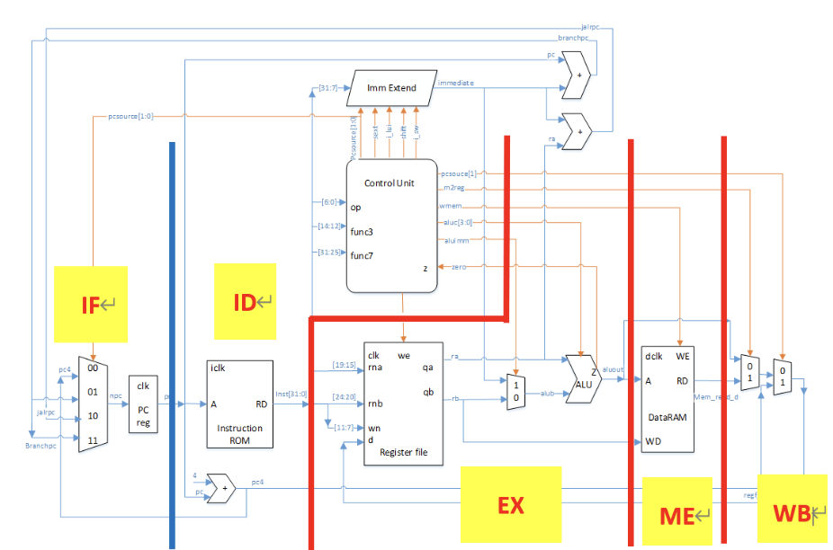
  <figcaption>图10：流水线划分图</figcaption>
</figure>

问题回答：
1. 左侧四选一MUX应算作IF阶段
2. 右上方两个加法器中计算branchpc的可以放到ID级。计算jalpc的不能，因为其输入依赖于EX阶段中ALU的输出。
3. 最右侧的二选一MUX必须在最后一级实现，不能在EX阶段实现，因为其输入需等待ME阶段存储器输出稳定。
4. forward操作不能在ID阶段实现，因为ID阶段进行hazard detection后才能决定是否前递EX阶段中ALU的结果。
5. stall操作将ID阶段的指令清除，保持IF阶段的指令。实现上可以保持IF/ID段寄存器的内容，将ID/EX段寄存器置零。
6. flush操作将ID/EX阶段指令清除(ID/EX段寄存器和EX/ME段寄存器置零)，将控制信号均置零。