## 1. 自定义指令的实现

对even rd, rs1, rs2指令的各位段二进制编码如下。R-type指令`op`位段为`0110011`，`func7`与`func3`字段可自定义，不与现有指令冲突即可，我选去`func7`=`0100000`, `func3`=`110`。

要对`alu`输入相应的`aluc`来使它执行求偶校验位操作，定义`aluc`为`1010`。此外R-type指令只需将`wreg`信号置1，其他控制信号均为0.

<figure style="text-align: center;">
  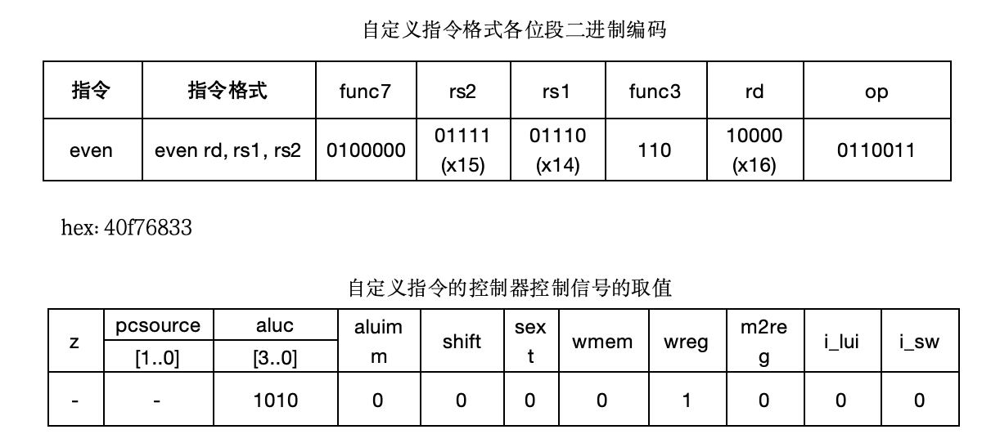
</figure>

对`sc_cu.v`做修改，使`sc-cu`能对`even`指令进行译码如下：

<figure style="text-align: center;">
  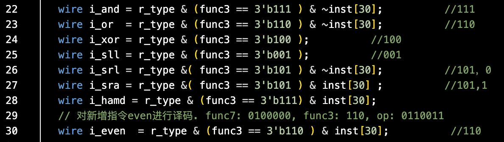
  <figcaption>图1：对even指令进行译码</figcaption>
</figure>

<figure style="text-align: center;">
  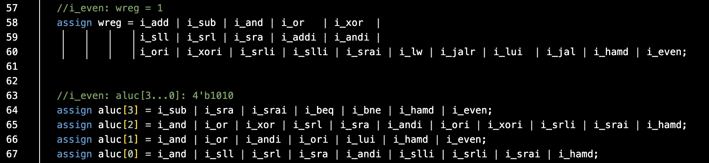
  <figcaption>图2：产生相应的wreg和aluc控制信号</figcaption>
</figure>

对`alu.v`做修改，使alu能计算偶校验位代码如下：

<figure style="text-align: center;">
  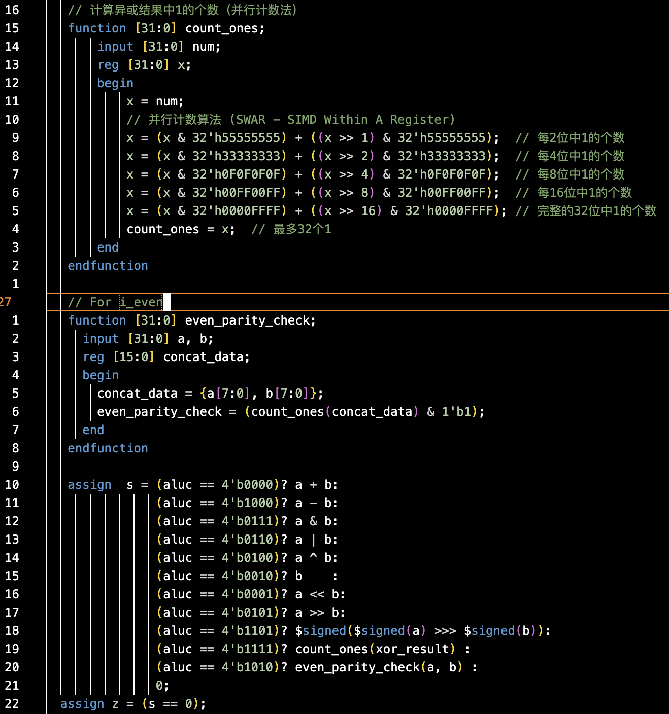
  <figcaption>图3：在ALU上实现偶校验位计算</figcaption>
</figure>

设计上，实现了计算偶校验位的`even_parity_check`函数，它复用了lab4中实现的count_ones函数。将ALU输入a, b的后8位合并为16位数，调用count_ones函数计数1的数量，将最低位与1'b1相与即可得到偶校验位。最后一位为1则为奇数个1，偶校验位应为1；否则为零。

## 2. 修改IO地址及拨码开关宽度

修改`inport0`, `inport1`的地址分别为`0xF0`, `0xF4`的代码如下：

<figure style="text-align: center;">
  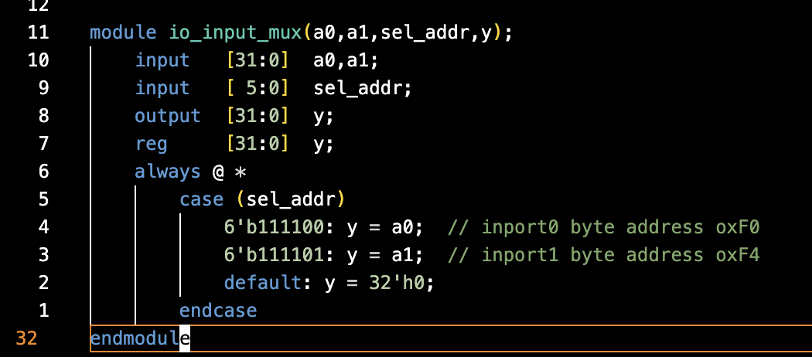
  <figcaption>图4：修改io_input.v中对应于inport0, inport1的地址</figcaption>
</figure>

为使测试程序能从相应位置读出数据，修改`io_output.v`中对应的代码：

<figure style="text-align: center;">
  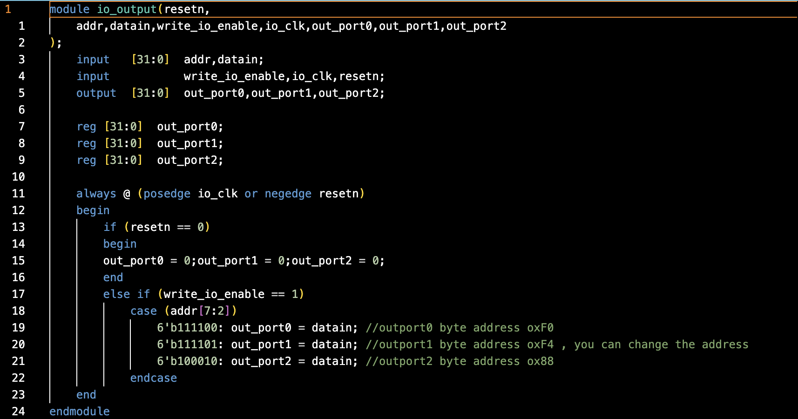
  <figcaption>图5：修改io_output.v中相应的地址</figcaption>
</figure>

为更改输入inport的拨码开关宽度，对`sc_cpu_iotest.v`的修改如下

<figure style="text-align: center;">
  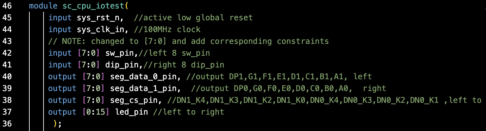
  <figcaption>图6：更改inport的定义为[7:0](8位)</figcaption>
</figure>

更改`in_port`模块的实现，拓展24位0:

<figure style="text-align: center;">
  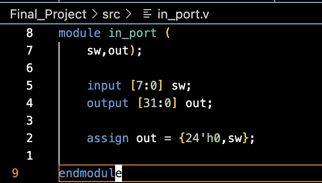
  <figcaption>图7：更改in_port输入为8位，补24位0</figcaption>
</figure>

要在板上实现，需要更改.xdc管脚约束文件：

<figure style="text-align: center;">
  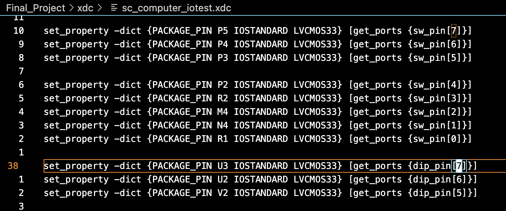
  <figcaption>图8：更改管脚约束文件，增加dip_pin[7:5]和sw_pin[7:5]相应约束</figcaption>
</figure>

为显示相应结果，修改`sc_cpu_iotest.v`中显示led以及数码管的代码如下：

<figure style="text-align: center;">
  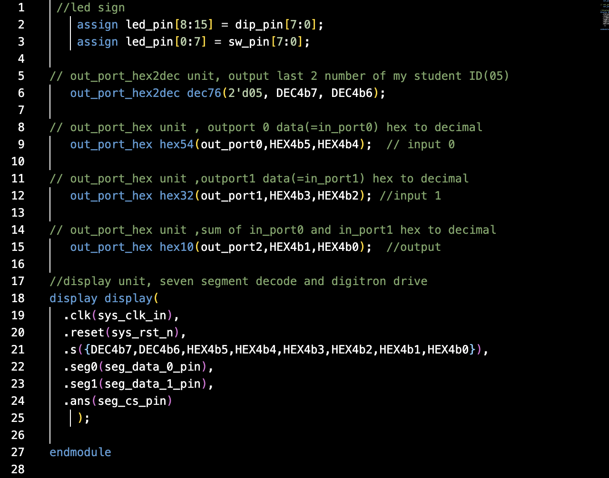
  <figcaption>图9：修改显示led和数码管代码，匹配显示要求</figcaption>
</figure>

其中`out_port_hex`为转换待显示数值为两位16进制数字的模块，实现如下：

<figure style="text-align: center;">
  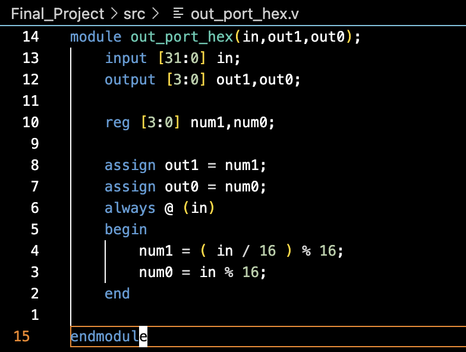
  <figcaption>图10：out_port_hex-将输入数值转换为两位16进制数</figcaption>
</figure>

## 3. 测试汇编源程序
与lab4中所给的测试代码类似。
<figure style="text-align: center;">
  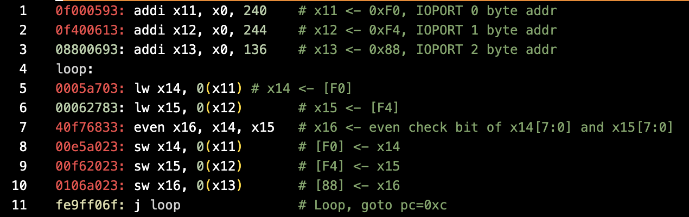
  <figcaption>图11：测试用汇编代码</figcaption>
</figure>

## 4. 板上执行结果照片

<figure style="text-align: center;">
  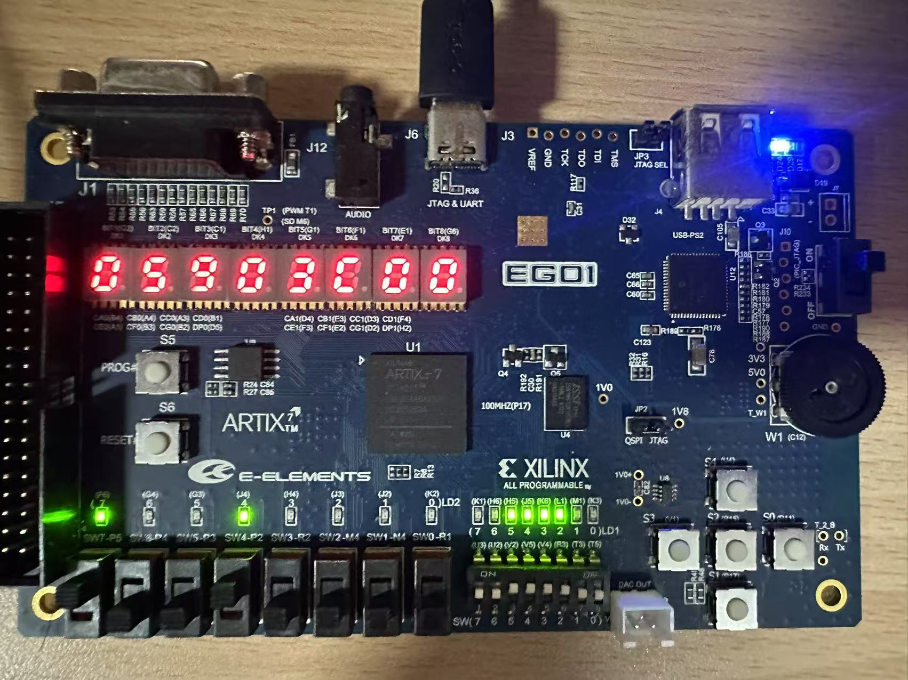
  <figcaption>图12：输入903c结果</figcaption>
</figure>
<figure style="text-align: center;">
  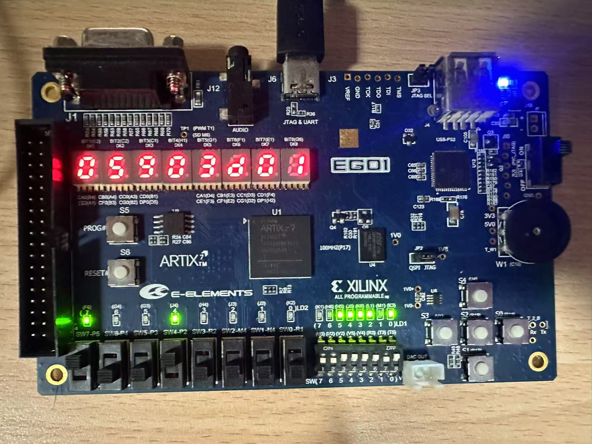
  <figcaption>图13：输入903d结果</figcaption>
</figure>
<figure style="text-align: center;">
  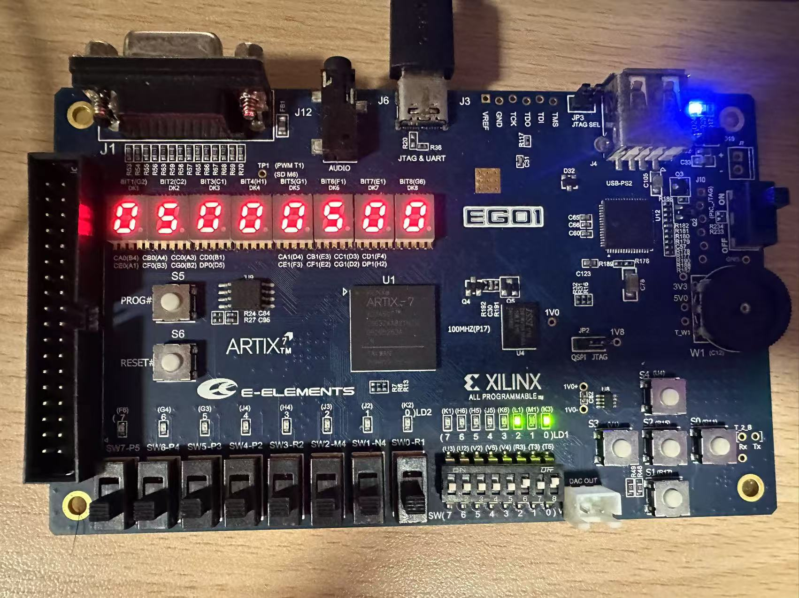
  <figcaption>图14：输入0005结果</figcaption>
</figure>
<figure style="text-align: center;">
  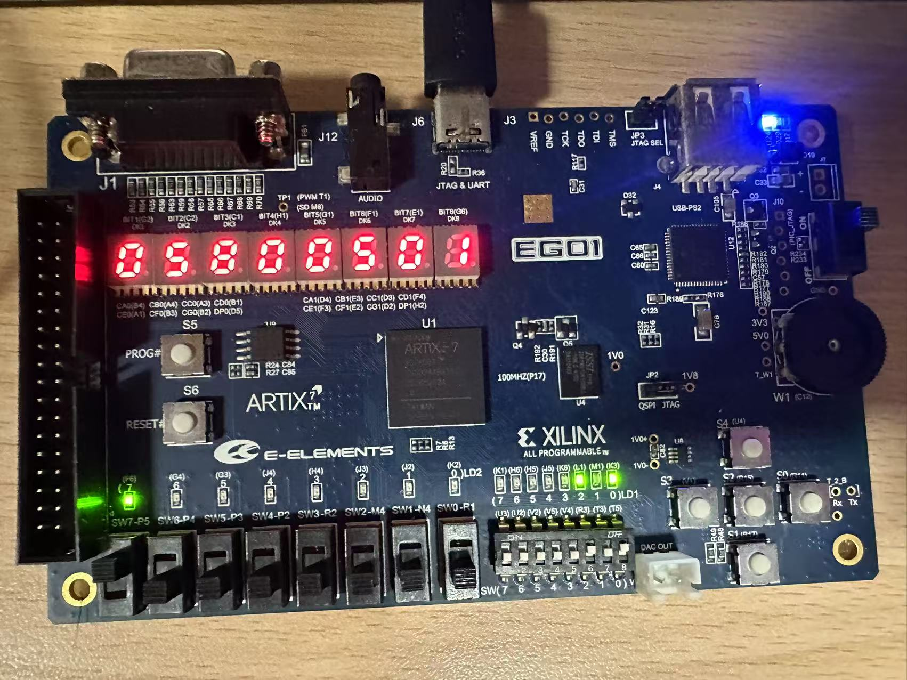
  <figcaption>图15：输入8005结果</figcaption>
</figure>

结果与预期均相符，可以正确输出偶校验位。