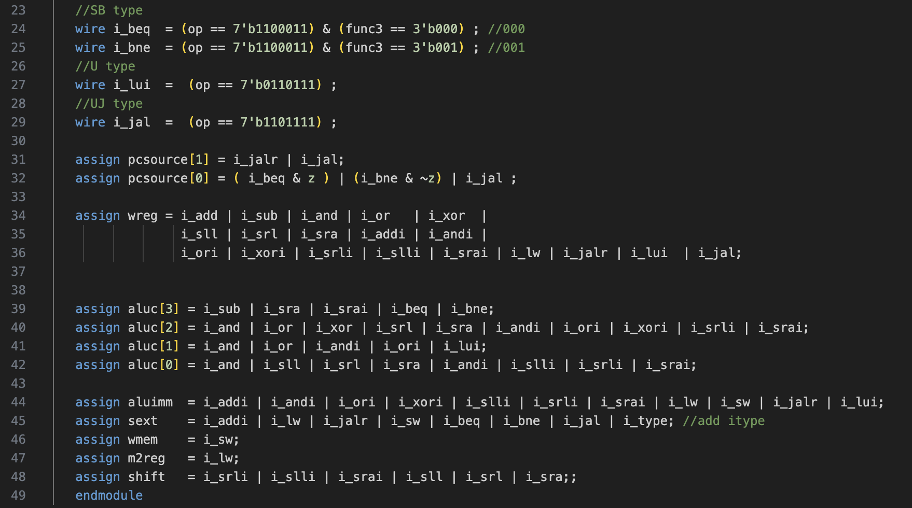

# Lab2
## 1. 控制器和立即数模块代码

<figure>
  
  <figcaption>图1: 控制器模块代码-第一部分</figcaption>
</figure>

根据各指令在RISC-V-Reference-Data中的格式定义，补充I-type, S-type指令的判断逻辑

<figure>
  
  <figcaption>图2: 控制器模块代码-第二部分</figcaption>
</figure>

根据各指令产生信号的情况，补充产生控制信号的逻辑。

<figure>
  
  <figcaption>图3: 立即数模块代码</figcaption>
</figure>

先定义各个指令中立即数的产生逻辑，再根据实际接收到的指令信号用assign语句组合逻辑产生立即数。

## 2. Vivado工程文件树截图

<figure>
  
  <figcaption>图4: Vivado工程文件树截图</figcaption>
</figure>

## 3. 板级测试照片

<figure>
  
  <figcaption>图5: 板级验证示例-译码lui x10, 0</figcaption>
</figure>

目前的演示中将zero值设置为1。下方16个led从左到右的含义为：
`inst[0], z, wmem, wreg, m2reg, aluc[3:0] , aluimm, pcsource[1:0], sext, i_lui, i_sw, shift`
上图中译码lui x10, 0。lui x10, 0的机器码的十六进制表示为00000537，对应的值如下：

<table style="text-align: center; border-collapse: collapse; margin: 0 auto;">
  <caption style="font-weight: bold; margin-bottom: 10px;">表1: lui x10, 0产生的控制信号表</caption>
  <thead>
    <tr>
      <th style="border: 1px solid #ddd; padding: 8px;">z</th>
      <th style="border: 1px solid #ddd; padding: 8px;">wmem</th>
      <th style="border: 1px solid #ddd; padding: 8px;">wreg</th>
      <th style="border: 1px solid #ddd; padding: 8px;">m2reg</th>
      <th style="border: 1px solid #ddd; padding: 8px;">aluc[3:0]</th>
      <th style="border: 1px solid #ddd; padding: 8px;">aluimm</th>
      <th style="border: 1px solid #ddd; padding: 8px;">pcsource[1:0]</th>
      <th style="border: 1px solid #ddd; padding: 8px;">sext</th>
      <th style="border: 1px solid #ddd; padding: 8px;">i_lui</th>
      <th style="border: 1px solid #ddd; padding: 8px;">i_sw</th>
      <th style="border: 1px solid #ddd; padding: 8px;">shift</th>
    </tr>
  </thead>
  <tbody>
    <tr>
      <td style="border: 1px solid #ddd; padding: 8px;">1</td>
      <td style="border: 1px solid #ddd; padding: 8px;">0</td>
      <td style="border: 1px solid #ddd; padding: 8px;">1</td>
      <td style="border: 1px solid #ddd; padding: 8px;">0</td>
      <td style="border: 1px solid #ddd; padding: 8px;">0010</td>
      <td style="border: 1px solid #ddd; padding: 8px;">1</td>
      <td style="border: 1px solid #ddd; padding: 8px;">00</td>
      <td style="border: 1px solid #ddd; padding: 8px;">0</td>
      <td style="border: 1px solid #ddd; padding: 8px;">1</td>
      <td style="border: 1px solid #ddd; padding: 8px;">0</td>
      <td style="border: 1px solid #ddd; padding: 8px;">0</td>
    </tr>
  </tbody>
</table>

<figure>
  
  <figcaption>图5: 板级验证示例-译码srai x18, x18, 16</figcaption>
</figure>

<table style="text-align: center; border-collapse: collapse; margin: 0 auto;">
  <caption style="font-weight: bold; margin-bottom: 10px;">表2: srai x18, x18, 16产生的控制信号表</caption>
  <thead>
    <tr>
      <th style="border: 1px solid #ddd; padding: 8px;">z</th>
      <th style="border: 1px solid #ddd; padding: 8px;">wmem</th>
      <th style="border: 1px solid #ddd; padding: 8px;">wreg</th>
      <th style="border: 1px solid #ddd; padding: 8px;">m2reg</th>
      <th style="border: 1px solid #ddd; padding: 8px;">aluc[3:0]</th>
      <th style="border: 1px solid #ddd; padding: 8px;">aluimm</th>
      <th style="border: 1px solid #ddd; padding: 8px;">pcsource[1:0]</th>
      <th style="border: 1px solid #ddd; padding: 8px;">sext</th>
      <th style="border: 1px solid #ddd; padding: 8px;">i_lui</th>
      <th style="border: 1px solid #ddd; padding: 8px;">i_sw</th>
      <th style="border: 1px solid #ddd; padding: 8px;">shift</th>
    </tr>
  </thead>
  <tbody>
    <tr>
      <td style="border: 1px solid #ddd; padding: 8px;">1</td>
      <td style="border: 1px solid #ddd; padding: 8px;">0</td>
      <td style="border: 1px solid #ddd; padding: 8px;">1</td>
      <td style="border: 1px solid #ddd; padding: 8px;">0</td>
      <td style="border: 1px solid #ddd; padding: 8px;">1101</td>
      <td style="border: 1px solid #ddd; padding: 8px;">1</td>
      <td style="border: 1px solid #ddd; padding: 8px;">00</td>
      <td style="border: 1px solid #ddd; padding: 8px;">1</td>
      <td style="border: 1px solid #ddd; padding: 8px;">0</td>
      <td style="border: 1px solid #ddd; padding: 8px;">0</td>
      <td style="border: 1px solid #ddd; padding: 8px;">1</td>
    </tr>
  </tbody>
</table>

## Appendix
板级验证视频附在压缩包内。