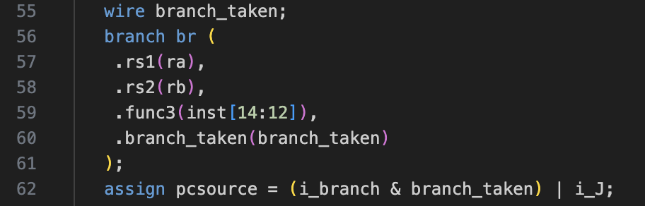

# Lab3：单周期CPU实验与仿真模拟 实验报告
## 实验目的
1. 掌握不同类型指令在数据通路中的执行路径，并用Verilog描述、实现
2. 掌握Vivado仿真方式

## 设计思路概述
导入实验一、二中已经实现的模块以及提供的加法器、选择器模块后，使用Block memory generator实例化指令ROM以及数据RAM。完成以上步骤后Lab3的文件树如下：

<figure style="text-align: center;">
  
  <figcaption>图1: Vivado工程文件树截图</figcaption>
</figure>

根据实验指导书中的结构图，在`sc_cpu.v`文件中完成各模块的例化以及信号在各模块间的通路。
以register file的例化为例。指导书中给出的信号图如下图：

<figure style="text-align: center;">
  
  <figcaption>图2: 指导书中register file数据通路</figcaption>
</figure>

例化register file模块的代码如下图。从`sc_cpu`模块定义中找到对应信号并接入实例化的regfile模块的输入、输出即可完成数据通路的连接。
<figure style="text-align: center;">
  
  <figcaption>图3: register file例化代码</figcaption>
</figure>

三个mux2x32的例化数据通路图和代码如下图。这三个二路选择器用于产生alub以及regf_din。

<figure style="text-align: center;">
  
  <figcaption>图3: 指导书中mux2x32的数据通路</figcaption>
</figure>

<figure style="text-align: center;">
  
  <figcaption>图4: 对应mux的例化代码</figcaption>
</figure>

其他组件如`immext`、`cla32`等的例化和指导书图中对应进行实例化即可完成

## 实验结果演示总结

总体波形如下图所示

<figure style="text-align: center;">
  
  <figcaption>图5: 仿真结果波形-第一部分</figcaption>
</figure>

<figure style="text-align: center;">
  
  <figcaption>图6: 仿真结果波形-第二部分</figcaption>
</figure>

与指导书中结果一致，程序执行到1515ns以后`pc`值为0000007c，指令`inst`为0000006f，`reg18`值为0001ffff

790ns处的波形如下图

<figure style="text-align: center;">
  
  <figcaption>图7: 仿真结果波形-第一部分</figcaption>
</figure>

<figure style="text-align: center;">
  
  <figcaption>图8: 仿真结果波形-第二部分</figcaption>
</figure>

执行的指令`inst`为`00022983`，即`lw x19, 0(x4)`，此处可见`reg16`值为0x0000000a，`reg19`在此时刻后被正确写入，置为0x0000000a，与lab2-1表中结果一致。

## 拓展思考
Ripes中的单周期CPU数据通路如下图
<figure style="text-align: center;">
  
  <figcaption>图9: Ripes中的单周期CPU数据通路示意图</figcaption>
</figure>

使用ALU代替单独加法器计算新的分支地址，则对于branch命令（即`beq`/`bne`）需要单独的分支判断模块，因为这样更改以后无法再通过ALU的zero输出来判断是否采用分支。代码实现如下图：

<figure style="text-align: center;">
  
  <figcaption>图10: 分支判断模块实现 <figcaption>
</figure>

<figure style="text-align: center;">
  
  <figcaption>图10: 例化分支判断模块 <figcaption>
</figure>

此外，`pcsource`信号改为一位且由`i_branch`/`i_J`(i_jal | i_jalr)与`branch_taken`(branch模块的输出)得到。

FPGA资源使用上，相比原设计，将四路选择器替换为一个二路选择器，根据`pcsource`选择ALU输出或pc4。增加了一个单独的分支判断模块。同时，还增加一个产生`alua`信号的多路选择器，根据当前指令是否为`i_branch | i_jal`选择`alua`是`ra`或`pc`。删除了原来的两个单独加法器。

具体的代码在附件zip文件中。将`branch.v`模块引入并将`sc_cpu.v`、`sc_cu.v`和`immext.v`替换并进行仿真，结果与原实现完全一致。