# Lab4: 简易单周期 CPU I/O扩展和新指令扩展实验

## 实验目的
1. 掌握CPU 的外设I/O 模块的设计方法。理解 I/O 地址空间的译码设计方法。
2. 掌握Vivado 仿真、实现、板级验证方式。
3. 通过扩展新指令的实现，深入理解CPU对指令的译码、执行原理和实现方式。

## 实验平台
1. MacOS Parallel Desktop虚拟机
2. Xilinx 的Vivado 开发套件(2019.1 版本)。
3. Xilinx 的EGO1 FPGA开发板

## 实验思路与过程

### 第一部分：I/O框架设计，仿真验证与板上验证
按照实验指导书中添加文件、创建项目后，主要对`sc_computer_main.v`, `sc_cpu_iotest.v`, `sc_datamem.v`进行连线修改。参考的数据通路图为实验指导书中图3，即下图部分

<figure style="text-align: center;">
  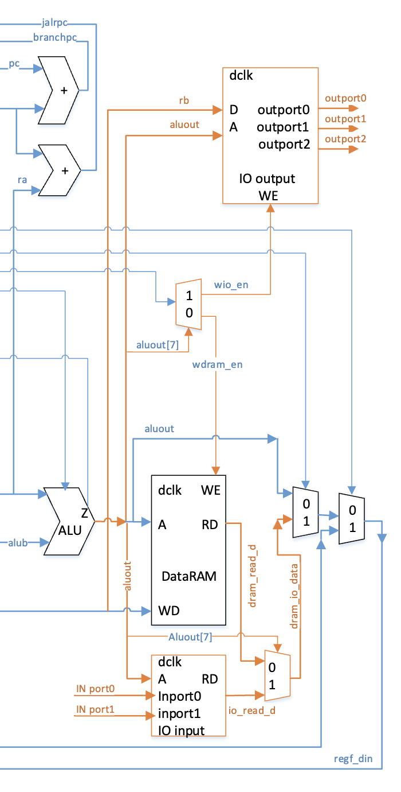
  <figcaption>图1: I/O框架数据通路图</figcaption>
</figure>

根据框架图在对应源文件中找到相应定义的信号，进行模块例化与连接。这里的地址定义方式为：0~-0x7f是data_mem的地址空间，0x80~0xff为I/O的地址空间。这在提供的文件中已经定义好。补充的`sc_datamem`中对`io_output`和`io_input`模块的例化代码如下图：

<figure style="text-align: center;">
  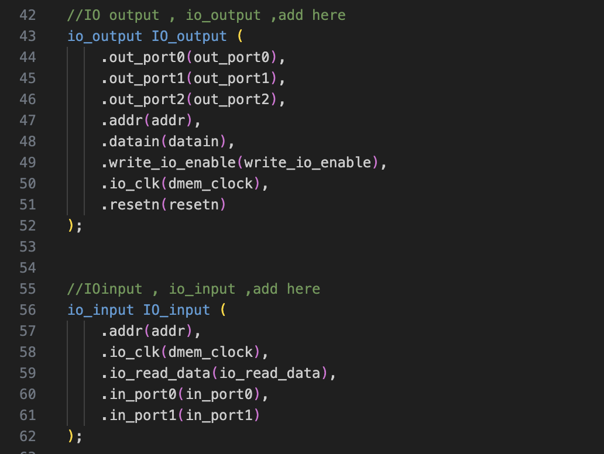
  <figcaption>图2: sc_datamem的I/O模块例化代码</figcaption>
</figure>

`datamem`模块在`sc_computer_main`中的例化如下图，根据框架图与模块定义进行相应例化即可。imem模块和sc_cpu模块与lab3中基本一致。

<figure style="text-align: center;">
  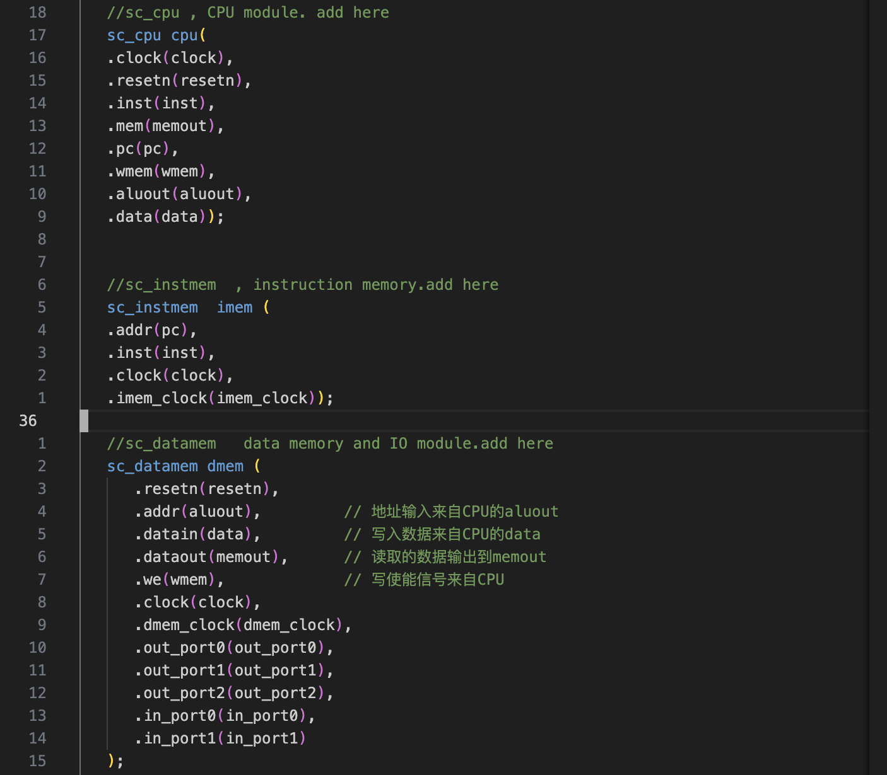
  <figcaption>图3: sc_computer_main例化代码</figcaption>
</figure>

`sc_computer_main`作为软核顶层加入了I/O框架后，可以将pc/inst等在lab3中用于测试功能的输入输出信号端口删去，保留clock与I/O端口即可。`sc_computer_main`在`sc_cpu_iotest`中的例化如下图。使用`clock_and_mem_clock`模块生成CPU核、IROM和DRAM的时钟信号，将in_port的五位信号拓展为32位，并接入例化的`sc_computer_main`即可完成CPU I/O框架的顶层子模块连接。

<figure style="text-align: center;">
  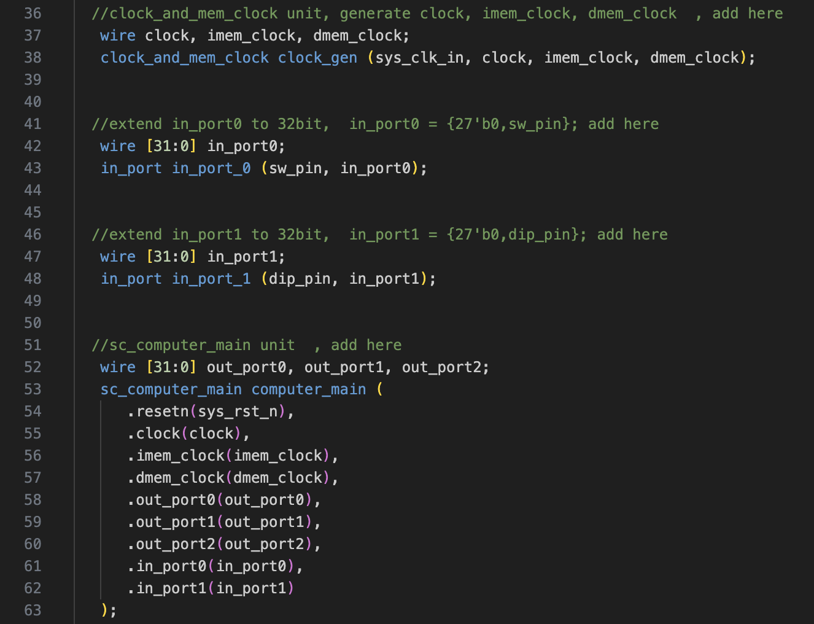
  <figcaption>图4: sc_cpu_iotest例化代码</figcaption>
</figure>

测试程序和实验指导书提供的相一致。

完成以上代码后使用提供的.coe文件进行IROM, DRAM的IP例化，即可进行仿真。根据实验指导书中对Generate Bitstream过程出现报错的错误进行修复（在管脚约束文件.xdc中加入set_property ALLOW_COMBINATORIAL_LOOPS TRUE [get_nets computer_main/cpu/rf/dram_i_492_1]）后，可以正确进行综合与实现，进行板级结果验证。仿真波形与板级验证图片见实验结果部分。

### 第二部分：扩展新指令hamd，仿真验证与板上验证

创建新的project，引入和lab4第一部分相同的文件，复制一份`alu.v`和`sc_cu.v`文件并替换项目中的文件，对`alu.v`和`sc_cu.v`进行修改以支持hamd自定义指令。

hamd指令格式为：func7 = 0100000，op = 0110011(即R-type的op), func3=111。原来实现的`sc_cu.v`中仅有`i_and`指令，它的func3和op字段与`hamd`一致，func7位0000000，与新添加的`hamd`指令仅可通过func7进行区分，也即`inst[30]`为1或为0。在`sc_cu.v`中增加对`hamd`指令的译码代码如下：

<figure style="text-align: center;">
  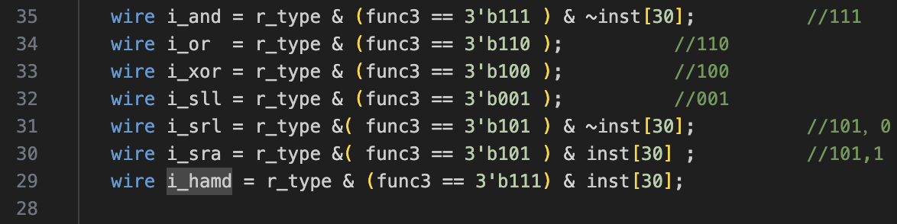
  <figcaption>图5: sc_cu.v中对hamd指令译码代码</figcaption>
</figure>

同时将hamd的aluc信号定义为1111，通过该信号指示alu进行汉明距离计算。产生aluc信号代码修改如下图。

<figure style="text-align: center;">
  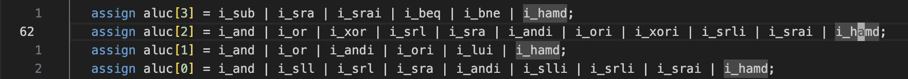
  <figcaption>图6: sc_cu.v中修改aluc信号产生逻辑 </figcaption>
</figure>

最后要在`wreg`中加入`| i_hamd`，使得i_hamd产生wreg信号，对regfile进行写入。代码如下

<figure style="text-align: center;">
  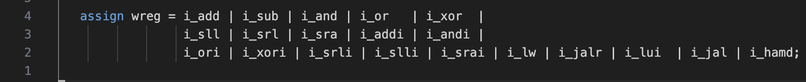
  <figcaption>图7: sc_cu.v中修改wreg信号产生逻辑</figcaption>
</figure>

其他控制信号不需要产生。接下来在`alu.v`中实现对两个32位数的汉明距离进行计算。首先将两输入取异或，再用分治并行方法数异或结果中1的个数，即可得到两数的汉明距离。在`alu.v`中添加代码如下

<figure style="text-align: center;">
  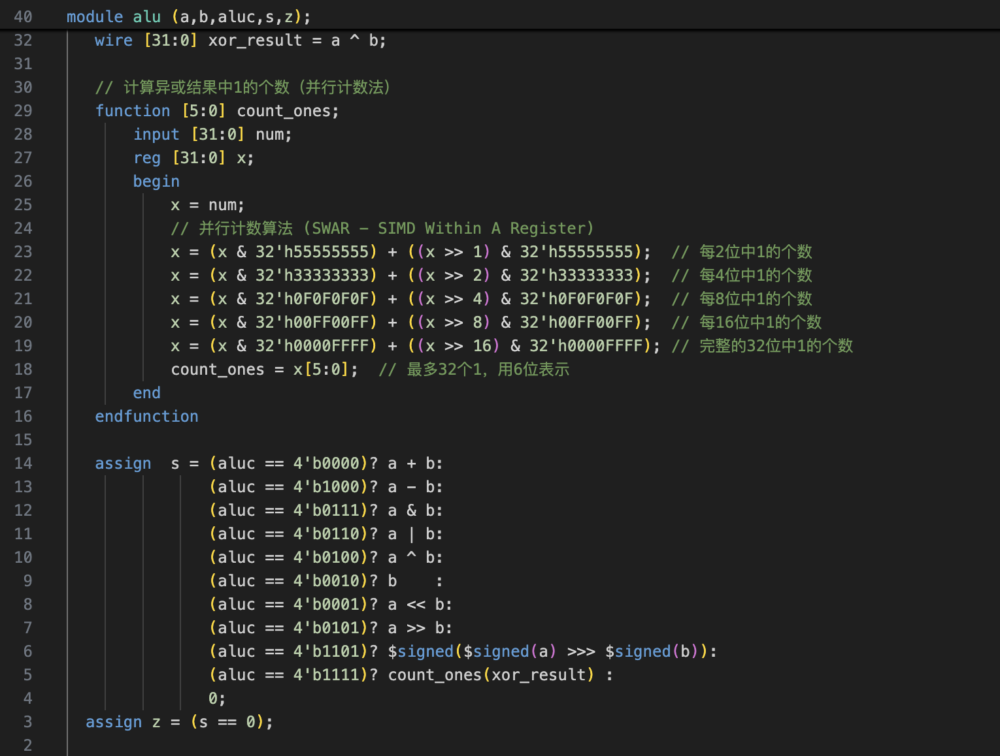
  <figcaption>图8: alu.v中实现汉明距离计算代码</figcaption>
</figure>

定义了count_ones函数，将a, b异或的结果输入即可得到汉明距离。解释如下：异或是将两数中位数相同的地方置零，不同的地方置一，那么求汉明距离只需求取异或后的数中1有多少个。直接使用右移判断的方法太慢，可以使用掩码与位运算，在32位数中进行并行分治操作来快速计算1的个数。第一次移位的掩码32'h55555555，即01的2位循环，移位相加计算后每2位中都存储着“原来数中这2位中1的个数”。第二次掩码为32`h33333333，即0011循环，移位相加将两位两位的结果两两合并，得到4位的“原来数中这4位中1的个数"。后面的掩码循环部分分别为00001111, 00FF, 0000FFFF，即将4位结果合成8位，8位结果合成16位，最后得到的32位表示原32位数中1的个数。由于32位数最多32个1，只需取后6位，作为alu的输出。

代码完成后，更改`lpm_rom_irom.coe`文件中add x16, x14, x15指令部分(00f70833)为hamd x16, x14, x15指令(40f778
33)，进行IROM与DRAM例化后，进行仿真验证。在.xdc中按generate bitstream的报错在.xdc中加入set_property ALLOW_COMBINATORIAL_LOOPS TRUE [get_nets computer_main/cpu/alu_b/alub[5]]语句，可以正确生成bit流进行板上验证。

## 实验结果
### 第一部分
仿真波形如下图

<figure style="text-align: center;">
  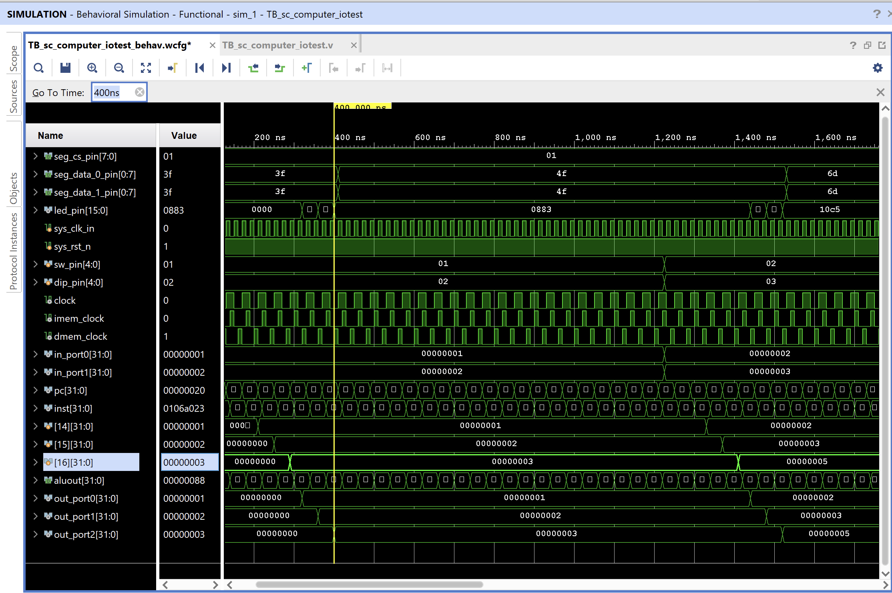
  <figcaption>图9: 第一部分仿真波形</figcaption>
</figure>

与实验指导书中参考结果一致，400ns后outport[2]为outport[1]与outport[0]之和，outport[1]和outport[0]分别与inport[1]/inport[0]相等。

板上验证照片如下图

<figure style="text-align: center;">
  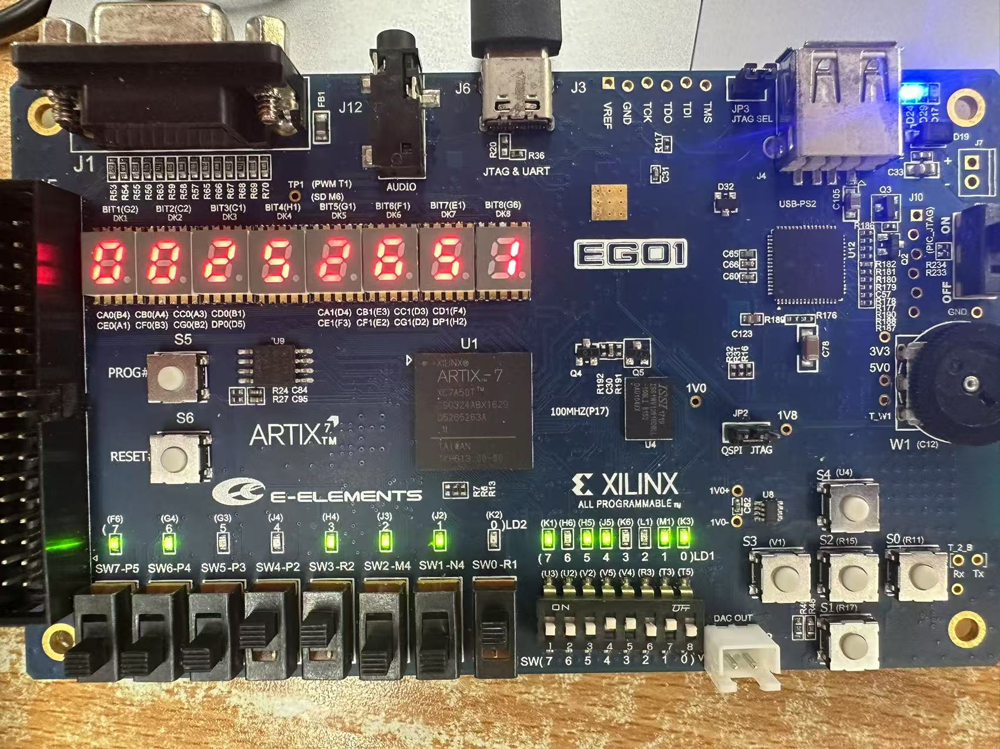
  <figcaption>图10: 第一部分板上验证结果<figcaption>
</figure>

11001(25)和11010(26)相加为51，在数码管上显示，结果正确。

### 第二部分
仿真波形如下图

<figure style="text-align: center;">
  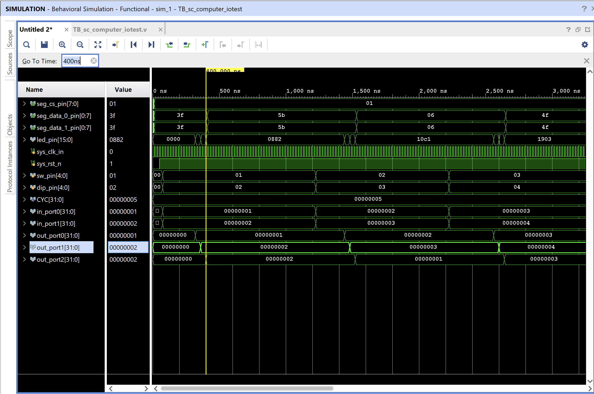
  <figcaption>图11: 第二部分仿真波形</figcaption>
</figure>

400ns后，outport[1]值为1，outport[2]值为2，二进制表示为01和10，汉明距离应为2，后续波形中010(2)和011(3)汉明距离为1，011(3)和100(4)汉明距离为3，均正确。

板上验证照片如下图

<figure style="text-align: center;">
  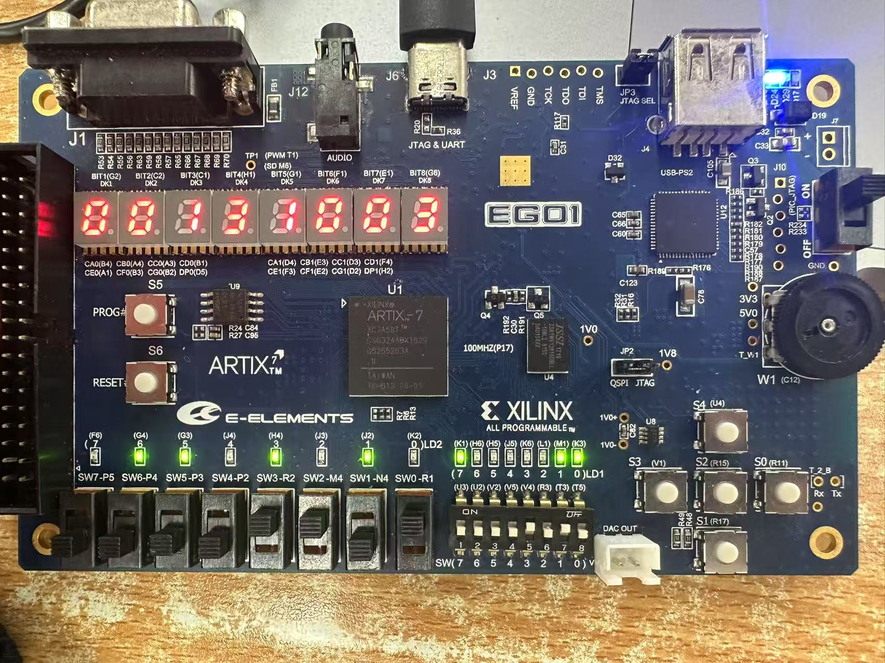
  <figcaption>图12: 第二部分板上验证结果<figcaption>
</figure>

01101(13)与01010(10)的汉明距离为3，在数码管上显示，结果正确。